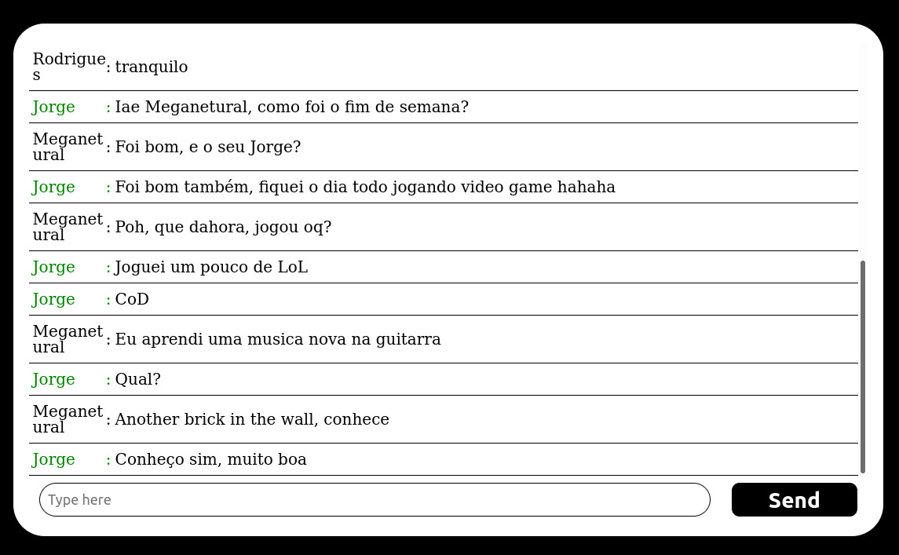

# Zapper

Hello, and welcome to zapper.

In this project I tried to create a simple app that would send and recieve messages.

# Link to deploy

https://zappers-front.vercel.app/

# technologies i used:

# How to run the project

First, clone the repo with

    git clone https://github.com/MarcioVCunha/zappers-front

Next, you will have to setup the back, you can find it here:

    https://github.com/MarcioVCunha/zappers-back

Then. we have to install the dependecies

    npm i

Finaly, in the front root, just use the

    npm start
  
command and your page is ready to use.
